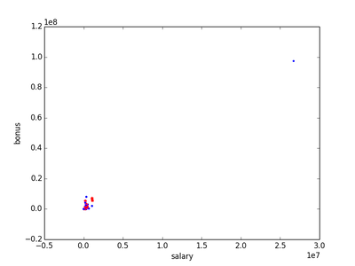
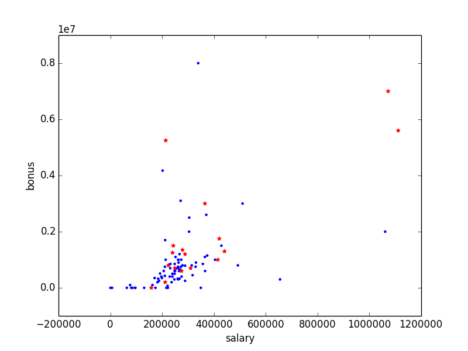

# Enron Email Fraud Detection with Machine Learning
**By Jason Carter**

## Summary
The goal of this project is to determine if by using the Enron email and financial dataset, can we create a model,
a Person Of Interest (POI) identifier, which will accurately predict if someone should be a person of interest for fraud. **check this** 
Machine learning is useful in trying to accomplish this goal because of it's ability to find trends, categorize data and learn from
this information in order to apply these learnings to new datasets. 

### Dataset
The Enron dataset is a corpus of information **used correctly?** which was discovered/gathered together due to the 
investigation of massive fraud and the down fall of a company called Enron. The Enron emails and financial information 
 were stitched together by Katie Mo? **check this** from Udacity.
 
### Data Exploration
When exploring the data, there were a number of outliers, some were not relevant while others were. In order to
determine exactly what to do with them more investigation was required. One outlier which was removed from the 
dataset was only representing the total values and not an actual datapoint, while another outlier was kept 
because although it was an outlier, it was very representative of the data and to our overall goal for the project.
Incompleteness was also a problem with the dataset that was discovered **TODO: finish thought**

Salary vs Bonus before dropping outliers

Salary vs Bonus after dropping outliers

Salary Bonus Bonanza (1M+ and 5M+): 
['LAVORATO JOHN J', 'LAY KENNETH L', 'BELDEN TIMOTHY N', 'SKILLING JEFFREY K', 'TOTAL', 'FREVERT MARK A']

Updating NaN values in features

Feature | # of NaN | | Feature | # of NaN
--- | --- | --- | --- | --- | ---
salary | 51 | - | to_messages | 60
deferral_payments | 107 | - | total_payments | 21
loan_advances | 142 | - | bonus | 64 
email_address | 0 | - | restricted_stock_deferred | 128
total_stock_value | 20 | - | shared_receipt_with_poi | 60
long_term_incentive | 80 | - | exercised_stock_options | 44
from_messages | 60 | - | other | 53
from_poi_to_this_person | 60 | - | from_this_person_to_poi | 60
poi | 0 | - | deferred_income | 97
expenses | 51 | - | restricted_stock | 36
director_fees | 129

## Feature Selection & Engineering
Both feature selection and engineering were performed and tested in creating the final model. 
Feature scaling was also utilized here... **add in here**

### Feature Selection

The final features utilized in the model are: 
* salary
* total_payments
* bonus
* total_stock_value
* exercised_stock_options
* shared_receipt_with_poi
* to_poi_fraction

### Feature Engineering
Three features were engineered for testing of the model. Only one was determined of substantially useful enough for 
during tuning. The engineered features are:

* to_poi_fraction - a fraction of the total 'to' emails that were sent to a POI 
* from_poi_fraction - a fraction of the total 'from' emails that were received from a POI
* salary_bonus_fraction - a fraction of bonus money **TODO:**

Utilizing SelectKBest, the top 7 features were selected via GridSearchCV. Below is a table of features and their scores:

Feature | Score
--- | --- | ---
bonus | 28.672077
salary | 14.837246
to_poi_fraction | 14.572074
total_stock_value | 10.005174
shared_receipt_with_poi | 9.683072
exercised_stock_options | 9.184393
total_payments | 8.376996
deferred_income | 8.064642
long_term_incentive | 7.967361
restricted_stock | 7.449035

**TODO: get final scores from cv**

## ML Model
The POI identifier model uses the Logistic Regression algorithm as it provided the best validation results. 
The other main algorithms used were Decision Tree, Random Forest and GaussianNB, all of which performed adequately in one 
aspect or another. For example, Random Forest provided the best accuracy score but not the best Precision and Recall score.
**add a little more**

### Tuning
Tuning the parameters of algorithm is simply the process of changing, testing and updating the parameters in order to get the
right mix or settings where once completed, the parameters are optimized to produce the best results. Most ML algorithms have parameters 
and in some cases there are defaulted values, so it's no always necessary to "tune" an algorithm but in a lot of cases it is. 
If you do tune your algorithm but not very well, you could end up with a model that seems correct but is actually providing false data.
For example, I had an issue where my accuracy score was very high during tuning but in validation the precision and recall were less than 0.1
I eventually realized that I was using "accuracy score" as the benchmark for my tuning but my validation tests were using the F1-score

In the case of my final model, I used the GridSearchCV function to determine the optimized parameters. Given a set of parameters, 
this function evaluates (fit, transforms) all of the possible combinations and scores, then returns a classifier, that provides the best score.

The parameters below show my Pipeline and their parameters (pipeline: MinMax_Scaling, SelectKBest, Logistic Regression)

>Pipeline(steps=[
>>      ('minmax_scaler', MinMaxScaler(copy=True, feature_range=(0, 1))), 
>       ('feature_selection', SelectKBest(k=6, score_func=<function f_classif at 0x102c00d70>)), 
>       ('logistic_reg', LogisticRegression(C=3, class_weight='balanced', dual=False,
>           fit_intercept=True, intercept_scaling=1, max_iter=100,
>           multi_class='ovr', n_jobs=1, penalty='l2', random_state=None,
>           solver='liblinear', tol=0.0001, verbose=0, warm_start=False))
> ])
            
### Validation
What is validation, and what’s a classic mistake you can make if you do it wrong? How did you validate your analysis?
[relevant rubric item: “validation strategy”]

overfitting, using all of the data for training and testing
test.py, compared against other models

### Model Results
Give at least 2 evaluation metrics and your average performance for each of them.
Explain an interpretation of your metrics that says something human-understandable about your algorithm’s performance.
[relevant rubric item: “usage of evaluation metrics”]

1. Define precision, recall and F1-score
2. Results can be in table
3. Interpret the results to human-understandable terms (convert to %)

Accuracy: 0.76540	Precision: 0.31168	Recall: 0.62850	F1: 0.41671	F2: 0.52231
Total predictions: 15000	True positives: 1257	False positives: 2776	False negatives:  743	True negatives: 10224

Accuracy: 0.76540	Precision: 0.31168	Recall: 0.62850	F1: 0.41671	F2: 0.52231
Total predictions: 15000	True positives: 1257	False positives: 2776	False negatives:  743	True negatives: 10224

sss training changed from folds 100 to default
Accuracy: 0.76380	Precision: 0.30213	Recall: 0.58900	F1: 0.39939	F2: 0.49500
Total predictions: 15000	True positives: 1178	False positives: 2721	False negatives:  822	True negatives: 10279

sss training changed from folds 100 to 1000 (similar to validation test)
Classifier tuning: 109.27
Accuracy: 0.76260	Precision: 0.30894	Recall: 0.63100	F1: 0.41479	F2: 0.52213
Total predictions: 15000	True positives: 1262	False positives: 2823	False negatives:  738	True negatives: 10177

sss training changed from folds 1000 to 100
Classifier tuning: 13.695
Accuracy: 0.76540	Precision: 0.31168	Recall: 0.62850	F1: 0.41671	F2: 0.52231
Total predictions: 15000	True positives: 1257	False positives: 2776	False negatives:  743	True negatives: 10224

Classifier tuning: 114.216 (1000)
Accuracy: 0.76540	Precision: 0.31168	Recall: 0.62850	F1: 0.41671	F2: 0.52231
Total predictions: 15000	True positives: 1257	False positives: 2776	False negatives:  743	True negatives: 10224

Classifier tuning: 63.325 (500)
Accuracy: 0.76260	Precision: 0.30894	Recall: 0.63100	F1: 0.41479	F2: 0.52213
Total predictions: 15000	True positives: 1262	False positives: 2823	False negatives:  738	True negatives: 10177